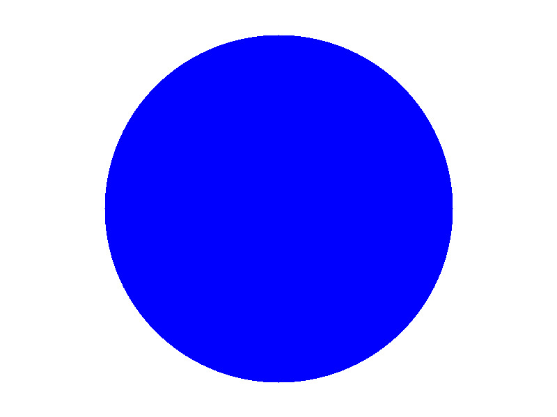

# Stage 1 — PPM Image Generator

This program generates simple raster images in the PPM format without using a
graphics library.

This stage focuses on understanding pixels, RGB colors, image coordinates,
basic geometry and file output.

## Features

- [x] Generate an image in the PPM format
- [x] Draw a solid-colored square
- [x] Draw a solid-colored circle
- [x] Select the shape using console input
- [x] Choose the square's side length or the circle's radius

## Results

## What I learned

The main lessons from this stage are summarized in the
[learning log](../../LEARNING_LOG.md).
