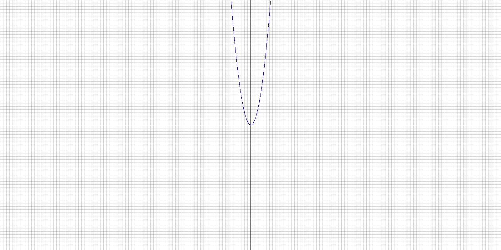
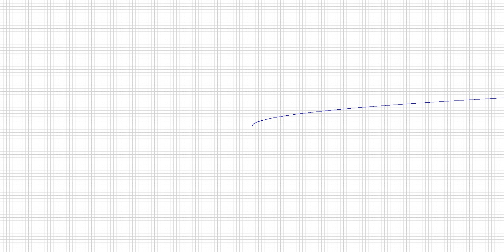
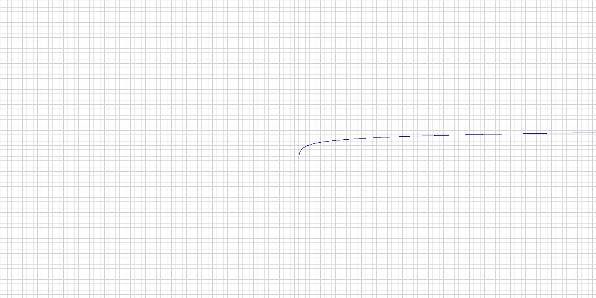

# Stage 2 — Coordinate Mapper

This program will let the user choose a function, such as `x²`, `log(x)` or
`sqrt(x)`, and generate an image of its graph.

## Project status

Work in progress — currently working on mapping between mathematical
coordinates and image pixels.

## Features

- [x] Generate an image in the PPM format
- [x] Draw the grid
- [x] Map mathematical coordinates to pixels
- [x] Draw the `x²` function
- [x] Draw the `log(x)` function
- [x] Draw the `sqrt(x)` function
- [x] Select a function using console input

## Results

### `x²`

### `sqrt(x)`

### `log(x)`

## What I learned

The main lessons from this stage are summarized in the
[learning log](../../LEARNING_LOG.md).
